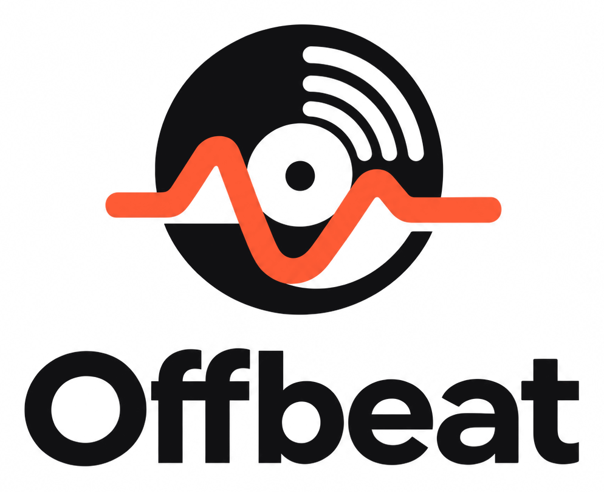
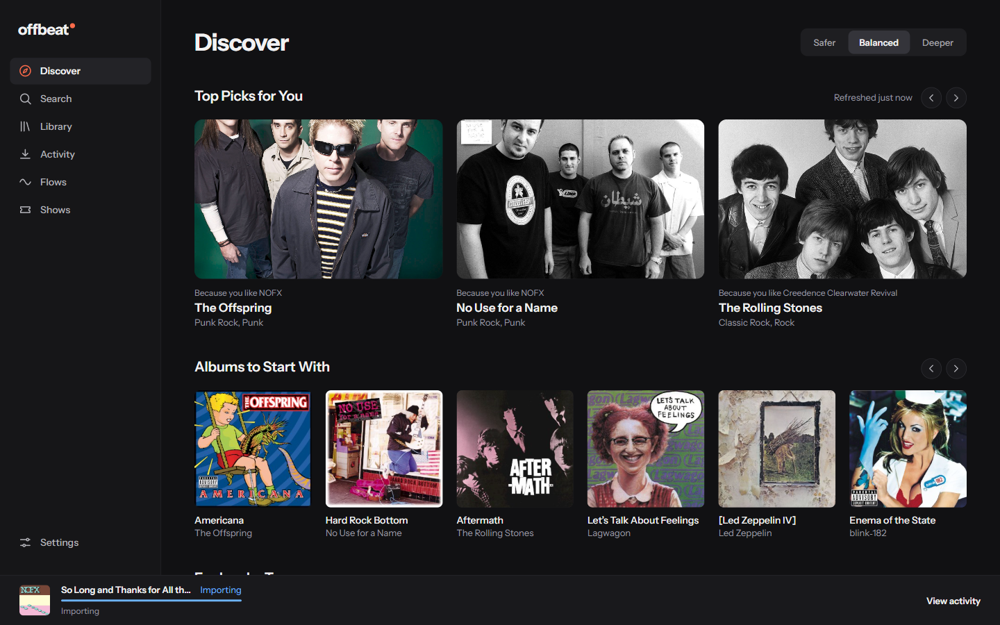
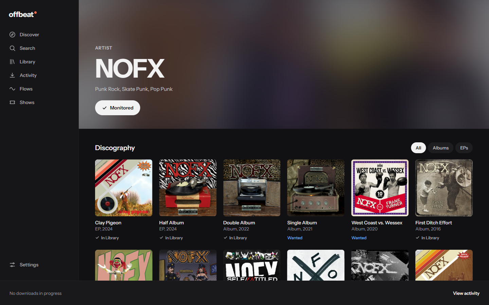
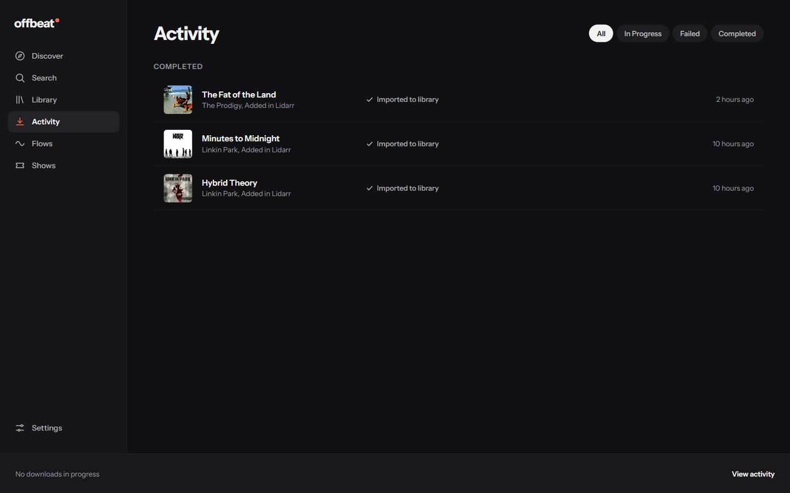
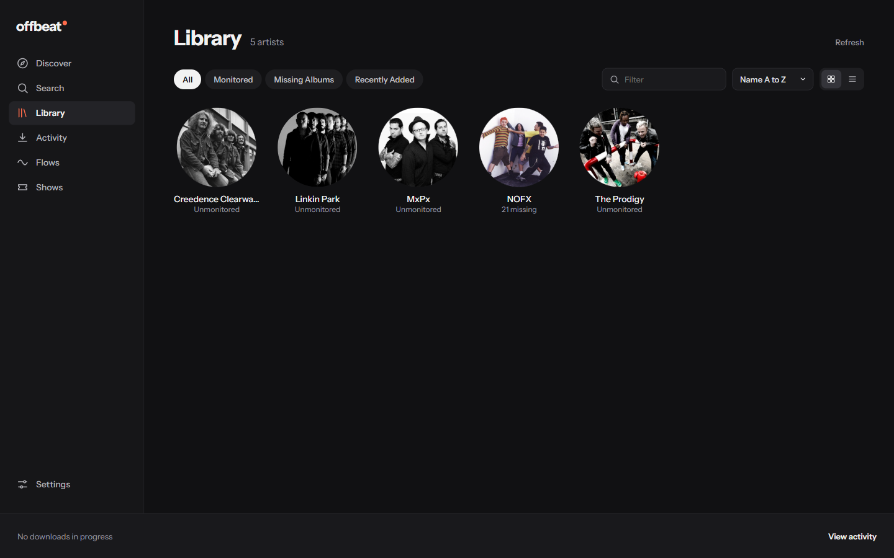
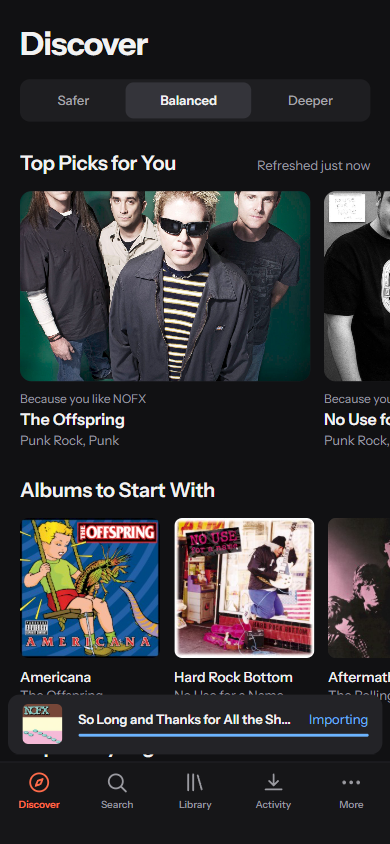

<h1 align="center">
  <picture>
    <source media="(prefers-color-scheme: dark)" srcset="docs/screenshots/offbeat-logo-dark.png">
    
  </picture>
</h1>

[](https://github.com/OffbeatOS/offbeat/actions/workflows/ci.yml)
[](https://github.com/OffbeatOS/offbeat/releases/latest)
[](https://github.com/OffbeatOS/offbeat/pkgs/container/offbeat)
[](LICENSE)

Self-hosted music discovery for Lidarr. Find new artists based on what you already have, add them to Lidarr in one click, and follow downloads as they land. Native streaming is planned.

> **Status: early.** Library, requests, discovery, and multiple users work today (see below). Versions before 1.0 may include breaking changes between releases, so read the release notes before upgrading. See the [roadmap](ROADMAP.md) for what is done and what is coming.



## What works

- **Discover.** Recommendations from your library and listening history, each with the reason it was picked ("Because you like NOFX"), in Safer, Balanced, or Deeper mode. Albums to start with, tag pages to explore, one-click adds, thumbs up and down, and a blocklist. Works with no API key through ListenBrainz; connect Last.fm for sharper picks.
- **Library.** Your Lidarr library as a fast, filterable grid, served from a local cache so it stays usable even when Lidarr is down.
- **Search, Artist, and Album pages.** Look up anything on MusicBrainz, see what you already have track by track, and add an artist or a single album in one click.
- **Sensible adds.** Adding an artist monitors all their albums and future releases; adding one album gets just that album. Lidarr searches right away, and everything Offbeat adds is tagged `offbeat`. All of it can be changed in Settings.
- **Activity.** Searches, downloads, and imports update live, with plain-English reasons when an import is blocked, and Retry or Cancel in one click. The bottom bar shows the current download on every page. Set up Lidarr's webhook (one click in Settings) and Activity updates within seconds.
- **Listening.** Play your library in the browser: FLAC and MP3 play as they are, and anything else is converted on the fly. The player stays put as you browse, with a queue you can reorder, a Now Playing view, lock screen and media key controls, and space and the arrow keys to play, pause, and seek.
- **Multiple users.** Admins and Members, with permissions for what each Member can do: stream, add artists, add albums, change monitoring, delete. Sign in with a password, through a reverse proxy such as Authelia or Authentik, or automatically on your local network. See [Sign-in options](#sign-in-options).
- **Notifications.** Discord or any webhook when an album is imported, a download fails, an import is blocked, or a monitored artist has a new release. See [Notifications](#notifications).
- **One small container.** One process, one port, SQLite. No external database or cache.

Coming next: listening history, previews, and streaming to Subsonic apps. Flows and playlists come later.

Offbeat talks to Lidarr for everything in your library; it never writes to your music folders itself.

## Screenshots

| Artist | Activity |
| --- | --- |
|  |  |
| **Library** | **Discover on a phone** |
|  |  |

## Quick start (Docker)

Images are published for `linux/amd64` and `linux/arm64` as `ghcr.io/offbeatos/offbeat`. Pin a version (`0.3`) rather than `latest` while Offbeat is pre-1.0.

With `docker run`:

```sh
docker run -d --name offbeat --restart unless-stopped \
  -p 3001:3001 \
  -e PUID=1000 -e PGID=1000 -e TZ=Etc/UTC \
  -v "$(pwd)/config:/app/config" \
  -v /path/to/music:/music:ro \
  ghcr.io/offbeatos/offbeat:0.3
```

Or with Compose (the same file is in [docker-compose.yml](docker-compose.yml)):

```yaml
services:
  offbeat:
    image: ghcr.io/offbeatos/offbeat:0.3
    restart: unless-stopped
    ports:
      - "3001:3001"
    environment:
      - PUID=1000
      - PGID=1000
      - TZ=Etc/UTC
    volumes:
      - ./config:/app/config
      - /path/to/music:/music:ro
```

Open `http://<host>:3001`, create the admin account, and connect Lidarr. Use the Lidarr address Offbeat can reach from its container (often `http://lidarr:8686` on a shared Docker network), not necessarily the one in your browser.

Everything Offbeat stores (database, encryption key, image cache, logs) lives in the config volume, so backing up Offbeat means backing up that folder.

### Your music folder

Offbeat plays music straight from the folders Lidarr manages, and only reads them: mount your music read-only (`:ro`). Lidarr is the index, so Offbeat never scans the disk; it asks Lidarr where each file is.

- Mount the music at the same path Lidarr uses for its root folder (often `/music`), and Offbeat needs no setup.
- If Offbeat sees the folder somewhere else, enter where in Settings, Integrations, Lidarr, Music files. Save and Check reads each folder and a sample of files, and says what is wrong in plain words.
- On Unraid, add a Path to the Offbeat container: container path `/music`, host path the share Lidarr uses (for example `/mnt/user/data/media/music`), access mode Read Only.
- Offbeat runs as `PUID`:`PGID`, so that user needs read access to the music.
- Browsers play FLAC, MP3, AAC, and more directly. Anything else (ALAC in Chrome, WMA, APE) is converted to MP3 with ffmpeg as it plays; Settings, Integrations, Lidarr, Music files says whether Offbeat found it.
- Playing needs the Stream permission, which Members have unless an admin turns it off.

## Configuration

Integrations and add behavior are configured in the web UI. Environment variables cover deployment only:

| Variable | Default | Purpose |
| --- | --- | --- |
| `PORT` | `3001` | Listen port |
| `CONFIG_DIR` | `./config` (`/app/config` in Docker) | Where state is stored |
| `BASE_URL` | none | Subpath when behind a reverse proxy, for example `/music` |
| `PUID` / `PGID` | `1000` | User and group the container runs as |
| `TZ` | `UTC` | Timezone for schedules |
| `TRUST_PROXY` | `false` | Trust `X-Forwarded-*` headers (set this behind a reverse proxy) |
| `LOG_LEVEL` | `info` | `debug`, `info`, `warn`, or `error` |
| `SESSION_COOKIE` | `offbeat_session` | Session cookie name. Give each instance its own when several share a host, since browsers share cookies across ports |
| `FFMPEG_PATH` | `ffmpeg` | ffmpeg, for formats a browser cannot play. Included in the Docker image; on bare metal, install ffmpeg (4.0 or later, with libmp3lame) or point this at it |

## Sign-in options

Settings, Users, Sign-in has three ways in. Local accounts (username and password) are on by default and always work for admins.

**Reverse proxy header.** Behind Authelia, Authentik, or a similar proxy, Offbeat can trust the username the proxy sends (`Remote-User` by default).

- List your proxy's address under Trusted proxies. The header is ignored from every other address. In Docker, if the address Offbeat sees for your proxy is one that stands for every visitor (the bridge gateway, or Docker Desktop's 192.168.65.x), Offbeat trusts it only together with the shared secret below.
- Your proxy must set that header itself on every route to Offbeat, and remove it wherever it does not sign people in. A route that passes on a header the visitor made up would let anyone sign in as anyone.
- Recommended: generate a shared secret in the same settings and have your proxy send it on every request (in `X-Offbeat-Proxy-Secret` by default). Offbeat then ignores the username unless the secret comes with it, so even a misconfigured route cannot be used to sign in.
- Usernames Offbeat does not know are refused with a page asking them to see an admin. Turn on "Create accounts for new users" to add them automatically as Members who can stream and add albums. They are never made admins.
- Set Sign-out page to your proxy's sign-out address; otherwise signing out of Offbeat signs you straight back in.

**Local network auto-login** signs everyone on the addresses you list in as one chosen Member, with no password. It is off by default and never signs in as an admin. Offbeat only trusts the address of the connection itself, or the forwarded address from a trusted proxy; a request with forwarding headers from anywhere else never counts as local. In Docker, the addresses that published ports hand out for every visitor (the bridge gateway, and Docker Desktop's 192.168.65.x) never count as local either, so list your devices' own addresses, or run Offbeat with host networking.

Auto-login only answers requests addressed to Offbeat by a local name: an IP address, a name like `hoth`, a `.local`, `.lan`, or `.home.arpa` name, or the host of "Link back to Offbeat" in Settings, Notifications. That keeps a malicious web page from borrowing it through DNS rebinding.

Auto-login does not work on Docker Desktop (Windows and macOS): it hands every visitor to the container from the same address, so Offbeat cannot tell your devices apart and never treats them as local. Use it with Docker on Linux (including Unraid), where each device's own address comes through, or on bare metal.

## Notifications

Settings, Notifications sends alerts to Discord or to any URL (a generic webhook) when an album is imported, a download fails, an import is blocked, or a monitored artist has a new release. Each channel chooses its events and has a Send Test button. Set "Link back to Offbeat" to the address you open Offbeat at, and messages link to the album or artist. Failed sends are retried a few times and logged under Recent deliveries; they never hold anything else up.

New releases come from Lidarr's calendar: every 15 minutes Offbeat looks at albums released in the last week or due in the next 90 days, and tells you about one that has appeared for a monitored artist since the last look. An artist's albums do not count during its first day in Lidarr, so adding an artist does not flood your channel.

The generic webhook POSTs this JSON (`version` changes only when a field is removed or changes meaning; new fields may appear without it):

```json
{
  "version": 1,
  "event": "album-imported",
  "title": "Album imported",
  "message": "Untrue by Burial",
  "url": "https://offbeat.example.com/album/<release group MBID>",
  "artist": { "mbid": "<artist MBID>", "name": "Burial" },
  "album": { "mbid": "<release group MBID>", "title": "Untrue" },
  "reason": null,
  "occurredAt": "2026-09-28T18:27:03.000Z"
}
```

- `event` is `album-imported`, `download-failed`, `import-blocked`, `new-release`, or `test` (Send Test).
- `url` is null until "Link back to Offbeat" is set; `artist`, `album`, and `reason` can be null, and `reason` says why for failures and blocked imports.
- With a signing secret, each request has an `X-Offbeat-Signature: sha256=<hex>` header: the HMAC-SHA256 of the raw request body, keyed with the secret. Compare it in constant time before trusting the body.
- Answer with any 2xx. A 4xx (other than 408 or 429) is not retried; anything else is, a few times.

## Locked out?

Offbeat has a small admin command for when nobody can sign in. It works while Offbeat is running.

In Docker (`offbeat` is the container name from the examples above):

```sh
docker exec -it offbeat offbeat reset-password <username>
docker exec -it offbeat offbeat list-users
docker exec -it offbeat offbeat make-admin <username>
```

On bare metal, from the Offbeat folder, as the user that runs Offbeat and with the same `CONFIG_DIR`:

```sh
CONFIG_DIR=/path/to/config npm run --silent offbeat -- reset-password <username>
```

- `reset-password` prints a temporary password once. It works for 7 days, signs that user out everywhere, and they choose their own at next sign-in. Admins can do the same for other users in Settings, Users.
- `list-users` shows everyone who can sign in, with their role.
- `make-admin` makes a user an admin, for when the only admin account is lost.

## Contributing

Contributions are welcome. Start with [CONTRIBUTING.md](CONTRIBUTING.md): it covers setup, running without a real Lidarr, the checks CI runs, and the project's working agreements. Questions and ideas go to [Discussions](https://github.com/OffbeatOS/offbeat/discussions); security problems go through [SECURITY.md](SECURITY.md).

- [Roadmap](ROADMAP.md)
- [Architecture](docs/architecture.md)
- [Design system and mockups](docs/design/README.md)
- [Code of Conduct](CODE_OF_CONDUCT.md)

## License

[MIT](LICENSE)
